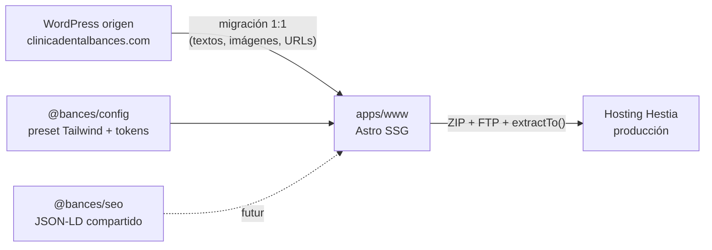

# Arquitectura — bances-web

## Visión general

Monorepo pnpm con una única app Astro SSG (`apps/www`) que replica 1:1 la web WordPress de Clínica Dental Bances. El blog NO es app separada: vive como ruta `/recomendaciones-y-consejos-dentales/` dentro de www, igual que en el WP origen (decisión derivada de la regla de URLs inmutables). Dos packages compartidos: `@bances/config` (tokens de marca y preset Tailwind — única fuente de verdad de la paleta) y `@bances/seo` (schemas JSON-LD, vacío hasta que una app lo consuma).

## Componentes

### apps/www (@bances/www)

App Astro 5 SSG. Layout con JSON-LD Organization, canonical, OG/Twitter, GTM por env y skip link AAA. Content Collections: `tratamientos` (12 páginas del WP) y `posts` (blog), ambas con campo `urlOriginal` para auditar la preservación de URLs.

**Archivos clave**: `apps/www/astro.config.mjs`, `apps/www/src/layouts/Layout.astro`, `apps/www/src/content.config.ts`, `apps/www/src/utils/siteConfig.ts`

### packages/config (@bances/config)

Preset Tailwind y design tokens. La paleta actual es PROVISIONAL (azul marino/blanco); se sustituirá por la extraída del CSS real del WP en la fase migración. Boundary: las apps consumen el preset, nunca duplican la paleta.

**Archivos clave**: `packages/config/tailwind.preset.cjs`, `packages/config/tokens/index.ts`

### packages/seo (@bances/seo)

Reservado para schemas JSON-LD y helpers compartidos. Vacío (`export {}`) hasta que se consuma.

**Archivos clave**: `packages/seo/src/index.ts`

## Flujo de datos

Build estático: contenido en Content Collections (`.md`/`.mdx` con frontmatter Zod) → páginas Astro → `dist/` → ZIP por FTP a Hestia. Sin backend salvo el endpoint PHP del formulario de citas (PHPMailer, pendiente de fase migración). Analítica vía GTM/GA4 (dataLayer, pendiente de fase gtm-baseline).

## Decisiones de diseño

Las decisiones de arquitectura se registran en la memoria persistente (`mem_save type=decision`). Las vigentes: app única (no subdominio blog), URLs inmutables sin 301, contenido 1:1 con el WP, deploy FTP patrón vitali/smedialab.
