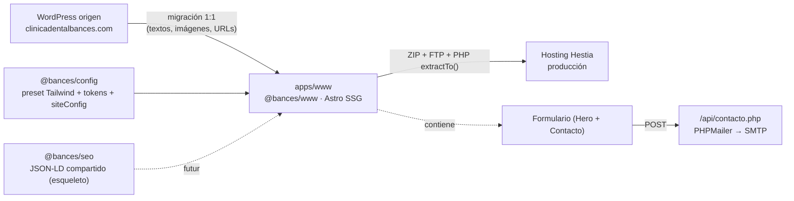

# Arquitectura — bances-web

## Visión general

Monorepo **pnpm** con una única app **Astro 5 SSG** (`apps/www`) que replica 1:1 la web WordPress de Clínica Dental Bances (clinicadentalbances.com, Santa Cruz de Tenerife). El blog NO es una app ni un subdominio separado: vive como ruta `/recomendaciones-y-consejos-dentales/` dentro de `www`, igual que en el WP origen (decisión derivada de la regla de URLs inmutables de `CLAUDE.md`).

Dos packages compartidos del workspace:

- **`@bances/config`** — preset Tailwind + tokens de marca + `siteConfig` base (datos reales de la clínica). Única fuente de verdad de la paleta y los datos de contacto.
- **`@bances/seo`** — reservado para schemas JSON-LD y helpers SEO compartidos (esqueleto, aún no consumido por la app).

El build es 100 % estático (`output: 'static'`). El único backend es el endpoint PHP del formulario de citas (`/api/contacto.php`, PHPMailer), que se sirve como archivo en `public/` y se ejecuta en el hosting Hestia.



## Stack técnico

| Capa | Tecnología | Versión |
|------|-----------|---------|
| Framework | Astro (SSG, `output: 'static'`) | `catalog: ^5.16.8` |
| Estilos | Tailwind CSS 3 + `@tailwindcss/typography` | `^3.4.17` / `^0.5.19` |
| Contenido | MDX (`@astrojs/mdx`) | `^4.3.0` |
| SEO | `@astrojs/sitemap` | `^3.7.0` |
| Lenguaje | TypeScript | `catalog: ^5.7.3` |
| Tipografías | `@fontsource/heebo`, `@fontsource/inter` | `^5.2.5` |
| Backend formulario | PHP 8 + PHPMailer | servido desde `public/api/` |
| Monorepo | pnpm 9.15.0 (catalog + `workspace:*`), Node ≥20 | — |

Configuración clave de Astro (`apps/www/astro.config.mjs`): `site: 'https://clinicadentalbances.com'`, `trailingSlash: 'always'`, `compressHTML: true`, dev server en puerto **4320** (`host: true`), e integraciones en orden `mdx() → tailwind({ applyBaseStyles: false }) → sitemap()`. Vite excluye `@bances/config` y `@bances/seo` del pre-bundling para hot-reload cross-package.

## Estructura de carpetas

```text
bances-web/
├── apps/
│   └── www/                         @bances/www — app Astro única
│       ├── astro.config.mjs         config (site, trailingSlash, puerto 4320, integraciones)
│       ├── package.json
│       ├── public/
│       │   ├── api/                  backend del formulario (se despliega tal cual)
│       │   │   ├── contacto.php      endpoint POST + PHPMailer
│       │   │   ├── config.local.example.php  plantilla de secreto SMTP (copiar en servidor)
│       │   │   └── lib/              PHPMailer.php · SMTP.php · Exception.php
│       │   └── wp-content/uploads/   imágenes migradas (rutas WP preservadas 1:1)
│       └── src/
│           ├── content.config.ts     Content Collections (tratamientos, posts, categorias, tags)
│           ├── env.d.ts
│           ├── layouts/
│           │   └── Layout.astro       <head> SEO: title, canonical, OG/Twitter, geo, JSON-LD, GTM, skip-link
│           ├── pages/                 rutas (file-based)
│           │   ├── index.astro                                      /  (home)
│           │   ├── dentista-en-santa-cruz-de-tenerife/index.astro   Quiénes Somos
│           │   ├── tratamientos-dentales-en-santa-cruz-de-tenerife/ Tratamientos (índice)
│           │   ├── seguros-dentales/index.astro
│           │   ├── instalaciones/index.astro
│           │   ├── recomendaciones-y-consejos-dentales/index.astro  índice del blog
│           │   ├── [categoria]/index.astro      archivo de categoría  /{categoria}/
│           │   ├── [categoria]/[slug].astro      post individual       /{categoria}/{slug}/
│           │   ├── tag/[tag]/index.astro         archivo de etiqueta   /tag/{tag}/
│           │   ├── aviso-legal/index.astro
│           │   ├── politica-de-cookies/index.astro
│           │   └── politica-de-privacidad/index.astro
│           ├── components/
│           │   ├── Header.astro · Navbar.astro · Footer.astro
│           │   ├── YouTubeEmbed.astro
│           │   ├── home/              secciones de la home (Hero, Intro, Servicios, Seguros,
│           │   │                      Opiniones, PrimeraVisita, Pagos, Colaboradores,
│           │   │                      Features, BlogDestacados, Contacto)
│           │   ├── paginas/           tarjetas de páginas internas (Tratamientos, Seguros, Equipo)
│           │   ├── blog/              PostCard.astro
│           │   └── ui/                Boton.astro · Seccion.astro
│           ├── content/
│           │   ├── tratamientos/      colección de páginas de tratamiento (.gitkeep — pendiente)
│           │   ├── posts/             47 posts del blog (.mdx, frontmatter Zod)
│           │   ├── categorias/        17 taxonomías de categoría (.json)
│           │   └── tags/              12 taxonomías de etiqueta (.json)
│           ├── data/
│           │   └── legal/             HTML legal migrado (aviso, cookies, privacidad)
│           ├── styles/
│           │   └── global.css         base de estilos (gobierna Tailwind; applyBaseStyles:false)
│           └── utils/
│               ├── siteConfig.ts      re-export de @bances/config + navegación real del WP
│               └── blog.ts            helpers de URL inmutable (parsearPermalink, hrefPost…)
├── packages/
│   ├── config/                       @bances/config
│   │   ├── tailwind.preset.cjs        ÚNICA fuente de la paleta (naranja Bances #EF7723…)
│   │   ├── tailwind-preset.cjs        re-export del preset
│   │   ├── tokens/index.ts            tokens de diseño
│   │   └── src/siteConfig.ts          datos reales: marca, dirección, teléfonos, email, geo, logos
│   └── seo/                           @bances/seo (esqueleto JSON-LD, sin consumir aún)
├── scripts/
│   └── import-blog-wp.mjs             importador del blog WP → Content Collections
├── pnpm-workspace.yaml               apps/* + packages/* + catalog de versiones
└── package.json                      scripts del monorepo (dev:www, build:www, deploy:www…)
```

## Content Collections

Definidas en `apps/www/src/content.config.ts` con el `glob` loader de Astro 5 y validadas con Zod. Solo existen las colecciones presentes en el sitio origen (réplica 1:1):

| Colección | Origen | Loader | Campos relevantes |
|-----------|--------|--------|-------------------|
| `tratamientos` | páginas de tratamiento del WP | `**/*.{md,mdx}` | `title`, `description`, `urlOriginal`, `heroImage`, `orden`, `draft` |
| `posts` | blog (`.mdx`) | `**/*.{md,mdx}` | base + `pubDate`, `updatedDate`, `author`, `categories[]`, `tags[]`, `wpId` |
| `categorias` | taxonomía de categoría (`.json`) | `**/*.json` | `slug`, `nombre`, `lead`, `descripcionHtml`, `wpId` |
| `tags` | taxonomía de etiqueta (`.json`) | `**/*.json` | `slug`, `nombre`, `lead`, `descripcionHtml`, `wpId` |

**Schema base compartido** (`baseSchema`): `title`, `description`, `urlOriginal` (permalink exacto del WP, con leading/trailing slash), `heroImage`, `draft`.

**Regla de URLs inmutables**: el campo `urlOriginal` preserva el slug exacto del WordPress. La URL de un post es SIEMPRE su `urlOriginal`, nunca se recalcula desde `categories[0]`. Las categorías y tags se migran TODAS para preservar sus URLs de archivo.

## Sistema de rutas

Rutas file-based de Astro. `trailingSlash: 'always'` (todas las URLs terminan en `/`, como el WP).

**Estáticas** (una por página del WP): `/`, `/dentista-en-santa-cruz-de-tenerife/`, `/tratamientos-dentales-en-santa-cruz-de-tenerife/`, `/seguros-dentales/`, `/instalaciones/`, `/recomendaciones-y-consejos-dentales/` (índice del blog) y las legales (`/aviso-legal/`, `/politica-de-cookies/`, `/politica-de-privacidad/`).

**Dinámicas** (`getStaticPaths` en build):

- `[categoria]/[slug].astro` → post individual `/{categoria}/{slug}/`. Genera un path por cada post no-borrador, extrayendo `(categoria, slug)` de `urlOriginal` con `parsearPermalink()` (`utils/blog.ts`). El permalink WP tiene 2 segmentos; la categoría es el primero y el slug el último.
- `[categoria]/index.astro` → `/{categoria}/`. **Bifurca**: si el slug es un tratamiento con contenido en `src/data/tratamientos.ts`, renderiza la landing rica `components/paginas/TratamientoLanding.astro` (hero + secciones reales + imágenes + posts relacionados + FAQPage); si no, el listado de la categoría del blog. Evita duplicar páginas y colisiones de routing.
- `tag/[tag]/index.astro` → archivo de etiqueta `/tag/{tag}/`.

Los slugs de 1 segmento reservados a páginas estáticas (`SLUGS_ESTATICOS` en `utils/blog.ts`) se excluyen de la ruta dinámica `[categoria]` para evitar colisiones.

## Capa SEO

Centralizada en `apps/www/src/layouts/Layout.astro` (props: `title`, `description`, `image`, `noIndex`, `canonicalOverride`, `breadcrumbs`, `article`):

- **`<title>`** compuesto (`título | marca`), **meta description**, **robots** (`index,follow` o `noindex,nofollow` según `noIndex`). Sin `<meta generator>` (política SMedialab: no exponer stack/versión).
- **Canonical**: `new URL(Astro.url.pathname, Astro.site)` o `canonicalOverride` (los posts lo fijan con `hrefPost(post)` para garantizar la URL inmutable).
- **Open Graph** (`og:site_name/type/url/title/description/image/locale`) y **Twitter Card** (`summary_large_image`); `og-default.jpg` 1200×630 como imagen por defecto.
- **Geo tags** locales (`geo.region`, `geo.placename`, `geo.position`, `ICBM`) desde `siteConfig.geo`.
- **JSON-LD** (serializados con `components/seo/JsonLd.astro`):
  - `@type: Dentist` (LocalBusiness) con datos reales: nombre, URL, logo/image, email, teléfonos, dirección, `geo`, `areaServed`, `openingHoursSpecification` (horario real de `siteConfig.openingHours`) y `sameAs` (Facebook/Instagram).
  - `BreadcrumbList` si llega la prop `breadcrumbs`; `BlogPosting` si llega `article` (wireado en los posts).
  - `FAQPage` emitido por `components/geo/Faq.astro`: FAQ general en la home (7 Q&A) y FAQ por tratamiento en `[categoria]/index.astro` (datos en `src/data/faqsTratamientos.ts`, 32 Q&A reales en 10 tratamientos).
- **GEO**: `public/llms.txt` + `llms-full.txt`; componente `components/geo/BloqueCita.astro` (NAP + horario citable) usado en "Quiénes Somos".
- **`robots.txt`** estático (`Disallow: /api/`, sitemap) y **sitemap** `@astrojs/sitemap` (`sitemap-index.xml`).
- **GTM/GA4**: inyectado solo si `PUBLIC_GTM_ID` está definido en `.env` (script `<head>` + `<noscript>` iframe) + `dataLayer` con evento `lead_form_submit` al enviar los formularios de cita.
- **Accesibilidad AAA**: `<html lang="es">`, skip-link "Saltar al contenido", `<main id="main">`, `:focus-visible` reforzado, `prefers-reduced-motion`, página `/accesibilidad/` (declaración W3C). Texto de cuerpo `ink-soft` #595959 (7:1).

## Flujo de datos del formulario

Hay **dos formularios** en la home, ambos con `method="post"` a `action="/api/contacto.php"`:

1. **Hero** (`components/home/Hero.astro`, "Solicitud rápida de cita"): `nombre` (req.), `email` (req.), `telefono`, `tratamiento` (select).
2. **Contacto** (`components/home/Contacto.astro`, sección `#Contacto`): `nombre` (req.), `email` (req.), `telefono`, `tratamiento` (select), `mensaje` (req.), `rgpd` (checkbox req.).

Flujo: el navegador hace POST `application/x-www-form-urlencoded` → `contacto.php` valida, aplica rate-limit + honeypot, envía el correo vía **PHPMailer/SMTP** a `info@clinicadentalbances.com` y responde con redirección **303** a `/?enviado=ok#Contacto` o `/?enviado=error#Contacto`. El endpoint también admite modo JSON (fetch con header `X-Requested-With: BancesContactForm`) como mejora progresiva. El secreto SMTP vive en `config.local.php` (no versionado). Detalle completo en `proyecto/api.md`.

## Tokens de marca

`packages/config/tailwind.preset.cjs` es la **única fuente de la paleta** (boundary del proyecto: las apps consumen el preset, nunca duplican colores). Paleta extraída del Kit de Elementor del WP origen y confirmada con captura de la home:

- `primary` (naranja Bances): `DEFAULT #EF7723`, `dark #D2641A`, `light #EFA068`, `pale #F1C1A0`.
- `ink`: `DEFAULT #0D0D0D` (títulos), `soft #7A7A7A` (cuerpo).
- `accent #EF7723` (alias semántico Elementor).

## Decisiones de diseño

Las decisiones vigentes (registradas en memoria persistente como `decision`): app única (no subdominio para el blog), URLs inmutables sin redirects 301, contenido y assets 1:1 con el WP origen, deploy FTP con patrón ZIP + `extractTo()` (vitali/smedialab), endpoint del formulario en PHP+PHPMailer servido desde `public/api/`.
